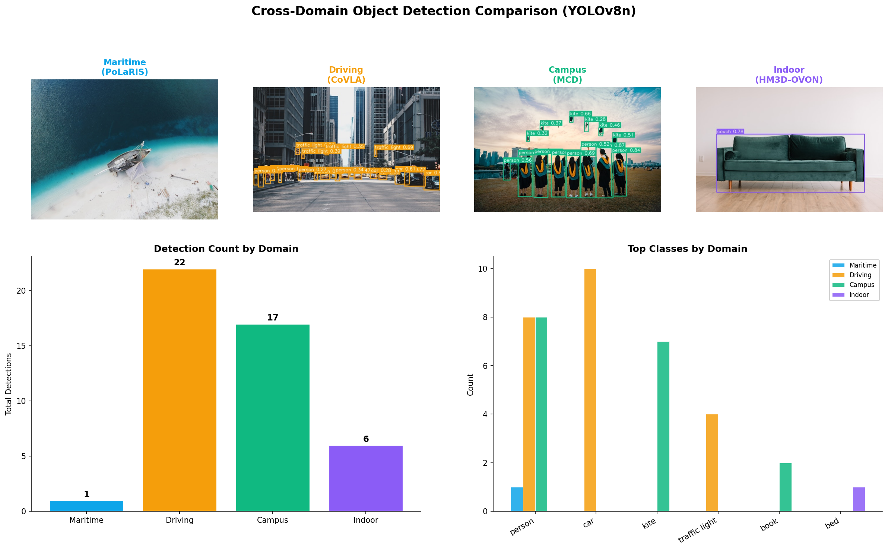

# crossdomain-object-tracker

<!-- badges -->
[](https://www.python.org/)
[](LICENSE)

**Cross-domain object detection and tracking evaluation tool for robotics datasets.**

Run the same object detection model (YOLOv8, Grounding DINO) across multiple robotics domains -- maritime, autonomous driving, campus, indoor, construction, and geographic diversity -- to quantify domain gaps and compare detection performance.



---

**ロボティクス向けクロスドメイン物体検出・追跡評価ツール**

同一の物体検出モデル (YOLOv8, Grounding DINO) を海上・自動運転・キャンパス・屋内・建設・地理的多様性の各ドメインのデータセットに適用し、ドメインギャップを定量評価・可視化します。

## Live Demo

**https://rsasaki0109.github.io/crossdomain-object-tracker/**

The demo page provides interactive Plotly.js charts for cross-domain metric comparison and a YOLOv8 detection gallery showing results across different datasets. No installation required.

## Supported Datasets

| Dataset | Domain | Modalities | Source |
|---------|--------|-----------|--------|
| [PoLaRIS](https://sites.google.com/view/polaris-dataset) | Maritime | Camera, LiDAR, Radar, GPS, IMU | KAIST |
| [CoVLA](https://huggingface.co/datasets/tali-research/CoVLA) | Autonomous Driving | Camera | Toyota Research Institute |
| [MCD](https://mcdviral.github.io/) | Multi-Campus | Camera, LiDAR, IMU | NTU / KTH / KAIST |
| [HM3D-OVON](https://aihabitat.org/datasets/hm3d-semantics/) | Indoor | RGB-D, 3D Semantics | Meta AI / Matterport |
| [SLABIM](https://github.com/SLABIM) | Construction / BIM | Camera, 3D BIM Models | ETH Zurich |
| [HK_MEMS](https://github.com/hk-mems) | Urban / MEP | Camera, LiDAR | HK PolyU |
| [GEODE](https://geodiverse-data-collection.cs.princeton.edu/) | Geographic Diversity | Camera | Princeton |

## Installation

```bash
git clone https://github.com/rsasaki0109/crossdomain-object-tracker.git
cd crossdomain-object-tracker
pip install -e ".[dev]"

# Optional: Grounding DINO support
pip install -e ".[grounding-dino]"
```

## Quick Start

```bash
# Download a dataset
crossdomain-tracker download --dataset covla

# Run evaluation with YOLOv8 across datasets
crossdomain-tracker evaluate --model yolov8n --datasets covla polaris mcd

# Generate comparison visualizations
crossdomain-tracker visualize --results outputs/results.csv

# Generate a report
crossdomain-tracker report --results outputs/results.csv --format markdown
```

## Hugging Face Spaces

Try the demo online (no installation required):
[Open in Hugging Face Spaces](https://huggingface.co/spaces/rsasaki0109/crossdomain-object-tracker)

## Demo App

```bash
pip install -e ".[app]"
streamlit run app.py
```

## Docker

```bash
# Build and run with GPU
docker compose up

# Or run CLI commands
docker compose run tracker crossdomain-tracker detect --model yolov8n --data-dir data/ --output outputs/

# CPU only
docker compose run tracker crossdomain-tracker evaluate --model yolov8n --datasets covla --data-dir data/
```

## Architecture

```
crossdomain-object-tracker/
├── configs/
│   ├── datasets.yaml          # Dataset definitions (URLs, modalities, formats)
│   └── models.yaml            # Model definitions (weights, thresholds)
├── src/crossdomain_object_tracker/
│   ├── common/
│   │   ├── config.py          # YAML config loader
│   │   └── download.py        # Dataset download utilities
│   ├── detector/
│   │   ├── yolo.py            # YOLOv8 backend (Ultralytics)
│   │   └── grounding_dino.py  # Grounding DINO backend (open-vocab)
│   ├── evaluate.py            # Cross-domain evaluation pipeline
│   ├── visualize.py           # Comparative visualization (matplotlib/plotly)
│   ├── report.py              # Report generation (Markdown/HTML/JSON)
│   └── cli.py                 # CLI entry point
├── scripts/
│   ├── download_datasets.py   # Standalone download script
│   └── run_demo.py            # Quick demo script
├── tests/                     # Unit tests
├── notebooks/                 # Jupyter notebooks for exploration
├── data/                      # Downloaded datasets (gitignored)
└── outputs/                   # Evaluation outputs (gitignored)
```

## Pipeline

```
Download datasets ──> Run detector on each domain ──> Compute metrics (mAP, F1)
                                                           │
                                                           ▼
                                              Visualize domain gaps
                                              (bar charts, heatmaps)
                                                           │
                                                           ▼
                                              Generate comparison report
```

## Citations

If you use this tool or any of the underlying datasets, please cite:

**PoLaRIS** (Maritime):
```bibtex
@article{pohang2023polaris,
  title={PoLaRIS: Pohang Canal Dataset for Maritime Object Detection and Tracking},
  year={2023},
  url={https://arxiv.org/abs/2307.12629}
}
```

**CoVLA** (Autonomous Driving):
```bibtex
@article{covla2024,
  title={CoVLA: Comprehensive Vision-Language-Action Dataset for Autonomous Driving},
  year={2024},
  url={https://arxiv.org/abs/2408.10845}
}
```

**MCD** (Multi-Campus):
```bibtex
@article{mcd2023,
  title={MCD: Diverse Large-Scale Multi-Campus Dataset for Robot Perception},
  year={2023},
  url={https://arxiv.org/abs/2301.12667}
}
```

**HM3D-OVON** (Indoor):
```bibtex
@article{hm3dovon2023,
  title={HM3D-OVON: A Dataset and Benchmark for Open-Vocabulary Object Goal Navigation},
  year={2023},
  url={https://arxiv.org/abs/2311.02991}
}
```

## License

MIT License. See [LICENSE](LICENSE) for details.
